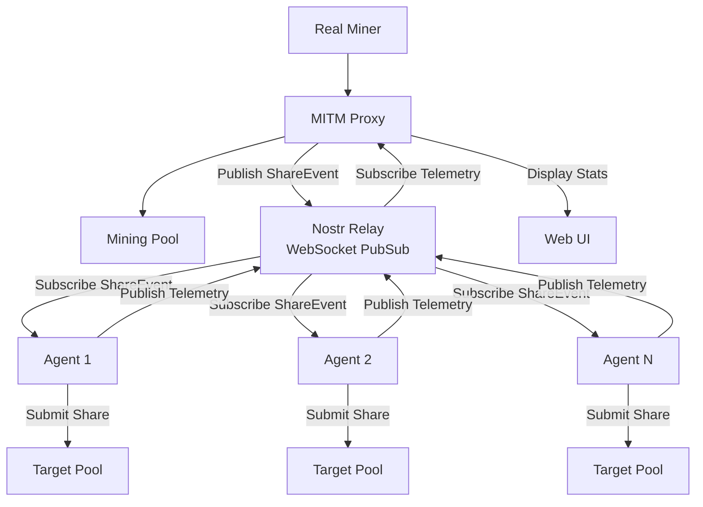

# Distributed Agent Fleet

## Overview

The distributed agent fleet enables load testing and pool analysis across multiple geographic locations. Agents receive share events via a Nostr relay and submit them to target pools independently.

### Key Features

- **Push-based Architecture**: Agents subscribe to share events via WebSocket (no polling)
- **Decentralized Coordination**: Nostr relay acts as pubsub for event distribution
- **Real-time Telemetry**: Agents report status, latency, and accept/reject ratios
- **Horizontal Scaling**: Add agents with `docker compose up -d --scale agent=N`
- **Geographic Distribution**: Deploy agents worldwide to test pool performance
- **Isolated Test Runs**: `RUN_ID` ensures no cross-talk between concurrent tests

## Architecture

The system uses Nostr relay as a coordination layer:



1. **MITM** captures real miner's share submissions
2. **MITM** publishes **ShareEvent** to Nostr relay (background, non-blocking)
3. **Agents** maintain WebSocket subscriptions to relay
4. **Agents** receive ShareEvent immediately (push, no polling)
5. **Agents** submit to target pool and record results
6. **Agents** publish **TelemetryEvent** back to relay
7. **MITM** subscribes to telemetry and exposes via local API to UI

### Event Schemas

#### ShareEvent (MITM → Agents)

Nostr event with:
- **Kind**: `NOSTR_KIND_SHARE` (e.g., 30078)
- **Tags**: `["t", "hashscope"]`, `["run", "<RUN_ID>"]`, `["type", "share"]`
- **Content**: JSON with Stratum `mining.submit` details

```json
{
  "schema": "hashscope.v1",
  "run_id": "test-run-123",
  "event_id": "uuid",
  "seq": 42,
  "ts": "2024-01-07T12:34:56.789Z",
  "pool": {"host": "pool.example.com", "port": 3333},
  "stratum": {
    "method": "mining.submit",
    "id": 1,
    "params": ["worker", "job_id", "extranonce2", "ntime", "nonce"]
  }
}
```

#### TelemetryEvent (Agents → MITM)

Nostr event with:
- **Kind**: `NOSTR_KIND_TELEMETRY` (e.g., 30079)
- **Tags**: `["t", "hashscope"]`, `["run", "<RUN_ID>"]`, `["agent", "<AGENT_ID>"]`
- **Content**: JSON with agent stats

```json
{
  "schema": "hashscope.v1",
  "run_id": "test-run-123",
  "agent_id": "agent-us-west-1",
  "ts": "2024-01-07T12:34:56.789Z",
  "pool_target": {"host": "pool.example.com", "port": 3333},
  "conn_state": "connected",
  "stats": {
    "share_events_received_total": 1523,
    "submits_attempted_total": 1520,
    "submits_accepted_total": 1450,
    "submits_rejected_total": 70,
    "last_submit_latency_ms": 42
  }
}
```

## Configuration

### MITM Proxy Settings

```bash
# Enable Nostr functionality
NOSTR_ENABLED=true

# Nostr relay (public or self-hosted)
NOSTR_RELAY_URL=wss://relay.damus.io

# Unique identifier for this test run
RUN_ID=test-run-$(date +%s)

# Optional: MITM private key (auto-generated if not provided)
# NOSTR_SK=<hex-private-key>
```

### Agent Settings

```bash
# Target pool to test
AGENT_POOL_HOST=stratum+tcp://pool.example.com
AGENT_POOL_PORT=3333

# Pool authentication
AGENT_WORKER_NAME=hashscope_test_agent
AGENT_WORKER_PASSWORD=x

# Nostr configuration
AGENT_NOSTR_RELAY_URL=wss://relay.damus.io
AGENT_RUN_ID=test-run-123  # Must match MITM's RUN_ID

# Optional: Agent private key (auto-generated if not provided)
# AGENT_NOSTR_SK=<hex-private-key>

# Telemetry interval
AGENT_TELEMETRY_INTERVAL_SEC=5
```

## Quick Start

### 1. Configure Environment

Create `.env` file:

```bash
# Pool configuration
POOL_HOST=stratum+tcp://your-pool.example.com
POOL_PORT=3333

# Enable Nostr
NOSTR_ENABLED=true
NOSTR_RELAY_URL=wss://relay.damus.io
RUN_ID=test-run-$(date +%s)

# Agent configuration
AGENT_WORKER_NAME=hashscope_test_agent
AGENT_WORKER_PASSWORD=x
```

### 2. Start the System

```bash
# Start MITM and frontend
docker compose up -d backend frontend

# Start 3 agents
docker compose up -d --scale agent=3
```

### 3. Enable Broadcasting

1. Connect a miner to `localhost:3333`
2. Open UI at `http://localhost:3000`
3. In Sessions panel, toggle "Broadcast to Agents" to ON
4. Agents will now receive share events and submit to target pool

### 4. Monitor Agents

- **UI**: Check "Agent Fleet" panel for status
- **API**: `curl http://localhost:8000/api/agents | jq`
- **Logs**: `docker compose logs -f agent`

## Security Notes

- Keep Nostr private keys secret (auto-generated are ephemeral)
- Use unique `RUN_ID` per test to prevent cross-talk
- Public relays expose events publicly - use self-hosted relay for sensitive tests
- Agents authenticate with target pools like normal miners

## Scaling Agents

```bash
# Scale to 10 agents
docker compose up -d --scale agent=10

# Check agent status
docker compose ps agent

# View specific agent logs
docker compose logs agent-1
```

## Troubleshooting

### Agents not receiving shares
- Check `RUN_ID` matches between MITM and agents
- Verify Nostr relay is accessible
- Check MITM logs for ShareEvent publishing
- Ensure broadcast is enabled for session in UI

### Agents not connecting to pool
- Check pool host and port configuration
- Verify worker name and password
- Check agent logs for connection errors

### No telemetry in UI
- Check agents are running: `docker compose ps`
- Verify Nostr relay connectivity
- Check browser console for errors
- Refresh UI page

