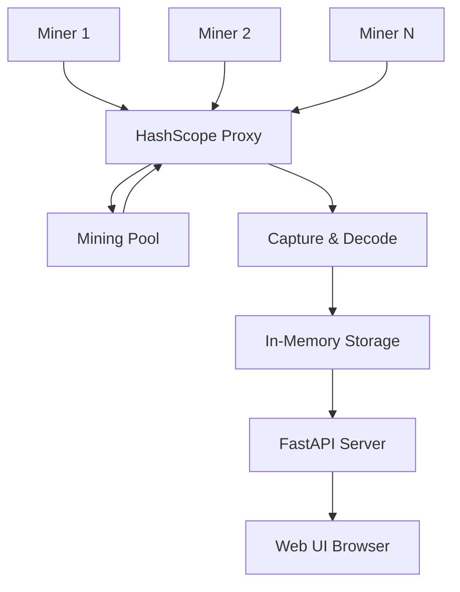
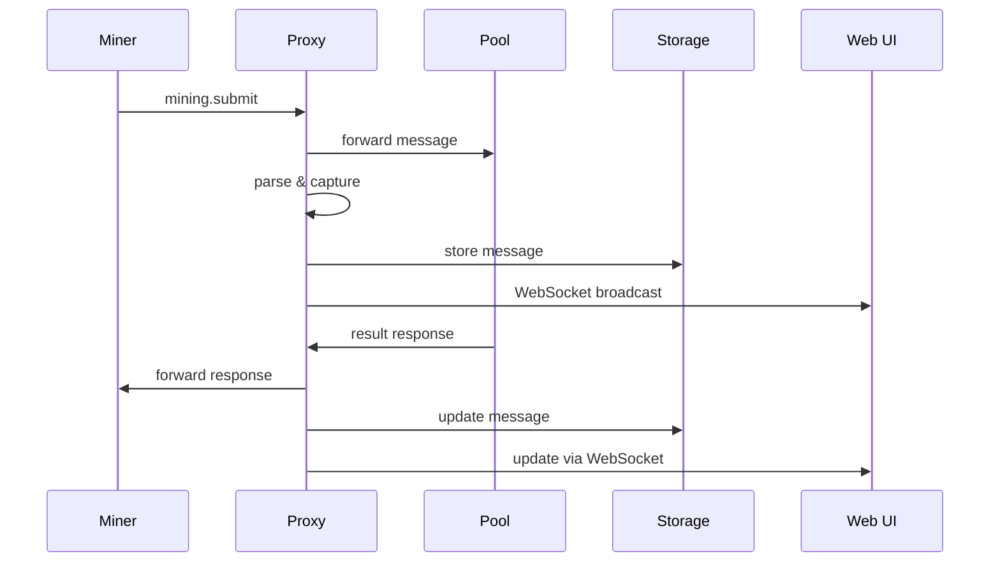

# Architecture Overview

## System Architecture

HashScope consists of multiple components working together to capture and visualize mining traffic:

### Core Components

#### Backend (Python + FastAPI)

**ProxyServer** (`proxy/server.py`)
- Listen on TCP :3333
- Accept new miner connections
- Create ProxySession for each
- Manage session lifecycle

**ProxySession** (`proxy/session.py`)
- One per miner connection
- Connect to upstream pool
- Bidirectional relay (asyncio tasks)
- Capture messages before forwarding
- Handle disconnections gracefully

**StratumParser** (`stratum/parser.py`)
- Parse JSON-RPC messages
- Best-effort (never throws)
- Returns ParsedMessage with success/error
- Encode messages back to bytes

**CaptureStorage** (`capture/storage.py`)
- In-memory ring buffer
- Thread-safe with asyncio.Lock
- Per-session and global storage
- WebSocket subscription support
- Query with filters

**FastAPI App** (`api/app.py`)
- Starts ProxyServer in background
- Exposes REST endpoints
- WebSocket for real-time
- CORS middleware
- Lifespan management

#### Frontend (React + TypeScript)

- **SessionList** - Displays all sessions
- **MessageFilters** - Search and filter controls
- **MessageTable** - Scrollable message list with live updates
- **MessageDetail** - Full message inspection
- **AgentStatus** - Agent fleet monitoring

## Data Flow

### Miner → Pool (Upstream)

1. Miner sends message to HashScope :3333
2. ProxySession receives and immediately forwards to pool (byte-for-byte)
3. In parallel: StratumParser decodes the message
4. CaptureStorage stores the captured message
5. WebSocket broadcasts to connected UI clients
6. UI updates in real-time

### Pool → Miner (Downstream)

1. Pool sends response to HashScope
2. ProxySession receives and immediately forwards to miner (byte-for-byte)
3. In parallel: StratumParser decodes the message
4. CaptureStorage stores and links to original request (if applicable)
5. WebSocket broadcasts to connected UI clients
6. UI updates the message pair

**Key Principle**: Relay is always transparent and never blocked by parsing or storage.

